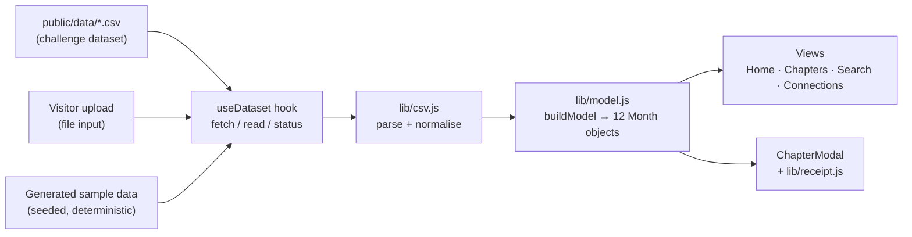

# Architecture

The app is a static single-page React app. There is no server: CSV files are fetched (or uploaded),
parsed, grouped and rendered entirely in the browser.

## Data flow

## Layers and responsibilities

| Layer                 | Files                                            | Rule                                                                       |
| --------------------- | ------------------------------------------------ | -------------------------------------------------------------------------- |
| Pure logic            | `lib/csv.js`, `lib/model.js`, `lib/receipt.js`   | No React, no DOM, no I/O — everything here is unit-tested in isolation.    |
| Configuration         | `lib/constants.js`                               | Every threshold and label lives here, so a "magic number" has one home.    |
| Data access           | `lib/dataSource.js`, `hooks/useDataset.js`       | The only code that fetches, reads files or picks between data sources.     |
| Behaviour             | `hooks/useDialog.js`                             | Reusable focus-trap / Escape / scroll-lock behaviour for any modal.        |
| Presentation          | `components/*`                                   | Receive plain props, render markup, never parse or aggregate data.         |
| Composition           | `App.jsx`                                        | Wires the hook, the model and the views together; owns only view state.    |

## Key decisions

- **Group by month of the year, not by date.** The two datasets are unrelated in time, so a real
  day-by-day join would be empty. Each month's busiest day is used as the "crossover" moment instead.
- **Derived values are computed once.** `buildModel` produces every number a view needs (totals, top
  category, mood, narrative, defining day). Views only format; they never recompute.
- **Mood and narrative are rule-based and explainable.** The rules and thresholds are in
  `constants.js` and `computeMood` in `model.js`, checked in a fixed priority order.
- **Search index is built once per dataset.** Lower-cased text and a sort key are precomputed; typing
  filters the array and uses `useDeferredValue` to keep input responsive on large files.
- **Rendering is capped, totals are not.** Long lists show a limited number of rows plus a "+N more"
  note, while every number is based on the full dataset.
- **Failure is visible and non-destructive.** Bad uploads show a message and never replace the data
  already on screen; render errors are caught by an error boundary.

## Testing strategy

- `tests/csv.test.js`, `tests/model.test.js`, `tests/receipt.test.js` — pure-function unit tests
  (parsing edge cases, mood rules, defining-day choice, correlation, receipt text).
- `tests/dataSource.test.js` — bundled-dataset loading with a mocked `fetch`, including the "SPA host
  returns index.html with status 200" trap.
- `tests/app.test.jsx` — renders the whole app, drives it with a keyboard-and-mouse user model, and runs
  `axe-core` on every view and on the open dialog.

## Known limitations

- Parsing runs on the main thread. That is fine for tens of thousands of rows; a multi-hundred-thousand
  row Spotify export would be a good candidate for a Web Worker.
- Colour contrast is verified by calculation (see README), not by `axe`, because jsdom has no layout.
- Grouping by month merges the same month across different years.
